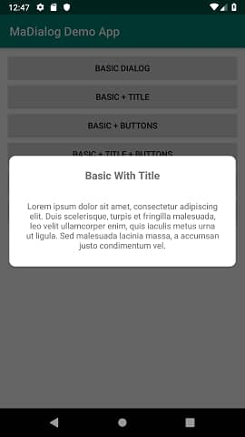
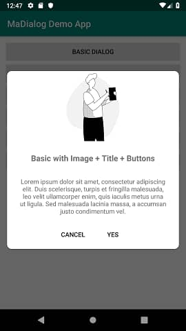
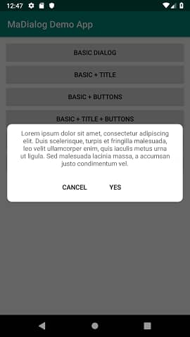

# MaDialog
Material Alert Dialog

[](https://jitpack.io/#umairayub79/MaDialog)

- min SDK 16
- was written in Java now in Kotlin
- simple beautiful dialogs with image and GIF support


## Screenshots





## Installation
Add this into your project's root build.gradle file
```java
allprojects {
	repositories {
		...
		maven { url 'https://jitpack.io' }
	}
}
```
Add the dependency to your module build.gradle:
```java
dependencies {
	implementation 'com.github.umairayub79:MaDialog:1.3'
}
```

## Example Usage
```java
//build a simple dialog

 new MaDialog.Builder(MainActivity.this)
                        .setTitle("Example Dialog")
                        .setMessage("Lorem ipsum dolor sit amet, consectetur adipiscing elit. Duis scelerisquevel. ")
                        .setPositiveButtonText("ok")
                        .setNegativeButtonText("cancel")
			setButtonOrientation(LinearLayout.HORIZONTAL)
                        .AddNewButton(R.style.AppTheme, "Yes", new MaDialogListener() {
                            @Override
                            public void onClick() {

                            }
                        })
                        .setPositiveButtonListener(new MaDialogListener() {
                            @Override
                            public void onClick() {
                              //todo
                            }
                        })
                        .setNegativeButtonListener(new MaDialogListener() {
                            @Override
                            public void onClick() {
                              //todo
                            }
                        })
                        .build();


//Available Methods

.setTitle(String);
.setMessage(String);
.setImage(int);
.setGif(int);
.setMessageTextColor(int);
.setTitleTextColor(int);
.setButtonTextColor(int);
.AddNewButton(int,String,MaDialogListener);
.setButtonOrientation(int);
.setBackgroundColor(int);
.setNegativeButtonText(String);
.setPositiveButtonText(String);
.setCancelableOnOutsideTouch(boolean);
.setPositiveButtonListener(MaDialogListener);
.setNegativeButtonListener(MaDialogListener);
.build();
```
